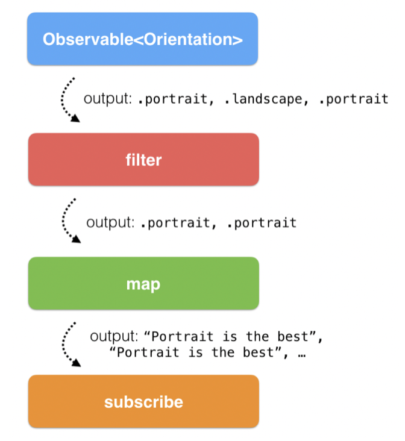

= RxSwift

===== ReactiveX
* Rx.NET, RxJS, RxJava, RxRuby, RxKotlin, RxSwift 등등 20개 이상 존재함
* 2009년 Rx.NET으로 ReactiveX가 시작함
* RxSwift는 2015년부터 시작됨
* *_ReactiveX = Reactive + Extension => 반응형 프로그래밍을 할 수 있게 해주는 확장팩_*

===== RxSwift
* _Observables가 기본이 되는 Asynchronour Programming Library_
* 기본이 되는 도구
** Observer Pattern
** Iterator Pattern
** Functional Programming
*** 고차함수
**** 함수가 다른 함수의 파라미터로 전달
**** 함수가 다른 함수의 결과로 반환
*** 순수함수
**** 부작용이 발생하지 않는 함수
**** 참조 투명성이 있는 함수

image:../images/observer-pattern.png[45%, 45%]
image:../images/iterator-pattern.png[45%, 45%]

image:../images/observables.png[45%, 45%x]
image:../images/observer.png[45%, 45%]

===== iOS에서 비동기 처리가 필요한 경우
* Button Taps
* Keyboard Animations
* Downloading Data
* Processing Images
* Writing on Disk
* Playing Audio, Video
* UI구성 요소 자체가 비동기적. iOS 앱을 만들 때 어떤 순서로 정하는 것은 불가능함. 일반적으로 iOS SDK API를 이용하여 처리함
* _비동기 처리하기 위해 iOS에서 이용할 수 있는 SDK API_
** Notification Center
** https://github.com/yuaming/learn-rxswift/issues/9[KVO, KVC]
** GCD
** Operation Queues
** Closures
** Target-Action
** Delegate Pattern => 언제 코드가 실행되고 얼마나 많이 호출되는지 알 수 없음

===== RxSwift 장, 단점
* 장점
** 선언형(Declarative)
** 함수형(Functional)
*** Side Effect가 무조건 나쁜 것이 아님. 다만, Side Effect가 언제 발생하는지 어떻게 동작하는지 Ouptut Data까지 결정할 수 있어야 함
** 일관성 있는 패턴, 연산자
** 가변상태(Mutable State)를 다룰 수 있음
*** 여기서 말하는 State. 한마디로 정의하기 힘들지만, 노트북을 처음 사용할 때 빠르게 동작하지만, 몇 주 지나면 이상한 동작을 할 때 있음. 하드웨어와 소프트웨어는 같은 상태를 유지하지만 단지 바뀐 것은 State 뿐. 그래서 노트북을 재시작하면 정상으로 돌아옴. 모든 Cloud 서비스에서 오는 사용자의 Input을 추척하는 모든 것들이 컴퓨터 상태를 나타냄. 앱의 상태를 관리할 때 특히 다수 비동기 Components 사이의 상태를 관리하는 것이 RxSwift 통해 배울 수 있음
** 복잡도가 없음
** 여러 플랫폼
** Notification처럼 관찰하다가 변화가 생기면 반응함
*** 따라서 비동기 코드를 핸들링하는 데 좋음
*** 특정 프로퍼티 등 반응형 객체로 만든 후, 이벤트가 발생하면 이를 처리하기 위해 함수 적용함
*** Delegation과 비교
**** 수많은 프로토콜을 정의할 필요 없음
*** Notification Center과 비교
**** RxSwift는 Subscribe 함수만 부르면 되지만, NotificationCenter 생성할 때 4개 파라미터가 필요함
*** Property Observer와 비교
**** 두 개 이상 객체가 새로운 데이터에 신경쓰고 있으면 관찰자 영역이 복잡해짐
**** RxSwift에서는 각각 함수 내에서 프로퍼티를 관찰할 수 있으므로 더 모듈화 할 수 있음
* 단점
** 러닝커브가 높음
** 다른 라이브러리들과 의존성
** 이해하지 않고 쓰면 문제가 발생할 수 있음
** 만병통치약이 아님

===== RxSwift 설치
* CocoaPods 

[source, bash]
----
platform :ios, '11.0'
use_frameworks!

target 'RxSwiftPlayground' do
    pod 'RxSwift', '~> 4.0'
end
----

* 프로젝트에서 RxSwift가 제대로 Import 되지 않으면 ?
** Project Clean 
** Project Clean으로도 문제가 해결되지 않는다면 _Command + , > Locations > Deviced Data의 경로를 확인_ 하고 해당 경로로 들어가 캐시된 프로젝트 파일을 지우고 해당 프로젝트 다시 염

===== Observables
* Asynchronour Stream
* Finite Observable Sequences
* Infinite Observable Sequences
* 이벤트를 주기적인 시간을 넘어 발생함
* 왼쪽으로 오른쪽으로 가는 화살표는 현재 시간의 흐름
* Observable 생명주기 동안 Any Point가 발생함

image:../images/rxswift-observables.png[45%, 45%]
image:../images/observables2.png[45%, 45%]

===== Operators
* Observable을 사용할 때 미리 정의된 Operator를 사용해 비동기 처리를 할 수 있음
* Operators는 주로 비동기 입력을 받고 Side Effect 없이 출력만 만듦

[source, swift]
----
UIDevice.rx.orientation
    .filter { value in 
        return value != .landscape
    }.map { _ in
        return "Portrait is the best!"
    }.subscribe(onNext: { string in
        showAlert(text: string)
    }).dispose()
----

===== Scheduler
* RxSwift에서 미리 정의된 스케줄러가 있기 때문에 개발자가 스케줄러를 만질 일이 거의 없음

===== RxCocoa
* UIKit과 Cocoa를 돕는 RxSwift 라이브러리. UIkit과 Cocoa를 지원하는 모든 클래스를 가지고 있음

[source, swift]
----
toggleSwitch.rx.isOn
    .subscribe(onNext: { enabled in
        print(enabled ? "On" : "Off")
    })
----