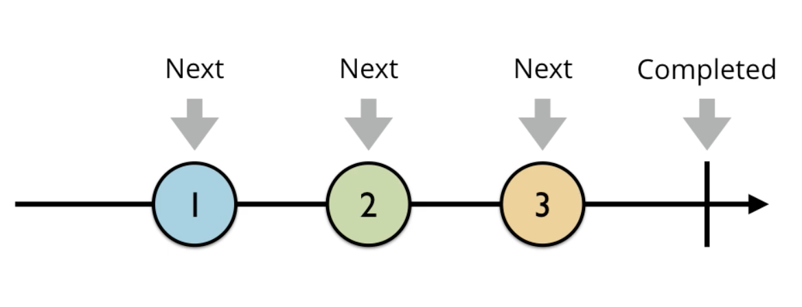

= RxSwiftExamples2

===== RxSwift, RxCocoa 적용
* UIImage

[source, swift]
----
func getImage(url: URL?) -> UIImage? {
    // ...
}

func getImage(url: URL?, handler: ((UIImage?) -> Void)) -> Void {
    // ...
}

func getImage(url: URL?) -> Observable<UIImage> { 
    // ...
}
----

* TextField

[source, swift]
----
// Before
override func viewDidLoad() {
    super.viewDidLoad()
    textField.addTarget(self,
                        action: #selector(textFieldDidChange(textField:)),
                            for: UIControlEvents.editingChanged)
}

@objc func textFieldDidChange(textField: UITextField){
    label.text = textField.text
}

// After
override func viewDidLoad() {
    textField.rx.text
    // 텍스트 변화를 감지하는 부분
        .bind(
            // 변화한 텍스트를 적용하는 부분
            to: label.rx.text
        ).disposed(by: disposeBag)
}
----

* API Response 관찰

[source, swift]
----
Observable<Model>.create { observer -> Disposable in
    API.getData(handler: { (model: Model?) in
        guard let model = model else {
            observer.on(Event.error(RxError.noElements))
            return
        }   

        observer.on(Event.next(model))
        observer.on(Event.completed)
    })

    return Disposables.create()
}.subscribe { (event: Event<Model>) in 
    switch event {
    case let .next(model):
        print(model)
    case let .error(error):
        print("error: \(error.localizedDescription)")
    case .completed:
        print("completed")
    }
}.disposed(by: disposeBag)
----

* KVO => Observable 변환

[source, swift]
----
self.label.rx.observe(String.self, "text")
    .subscribe { (event: Event<String?>) in
        switch event {
        case .next(let text):
            print("label: \(text)")
        default:
            break
        }
    }.disposed(by: disposeBag)
----

===== Observer, Observable
* Observer
** 관찰하는 주체(= 주어) 
** Reaction - Action: Reaction 하기 위해 Action을 감시함

* Observable
** 관찰되는 대상(= 목적어)
** 요소가 가지고 있는 이벤트를 계속 방출함
** Subscribers가 방출한 이벤트들에 대해 반응할 수 있음

* Observable Life Cycle 
** Next => Interger 또는 Tap
** Error => Observable 종료됨
** Completed => Observable 종료됨
* Observable Events
** 열거형으로 구성됨

[source, swift]
----
public enum Event<Element> {
    case next(Element)
    case error(Swift.Error)
    case completed
}
----

===== Subscribe, Emit, Dispose
* Subscribe => Observer가 Obserable를 구독함
* Emit => Observable가 이벤트 방출
* Dispose => Observable의 Event 발행이 Complete되면 Dispose함

===== Dispose
* dispose() => 즉시 처분
* DisposeBag => Disposable 들을 모아두다가 한번에 처분함

===== Creating Observables
* just 
* from
* of
* empty => Complete Event만 방출함
* never => 아무런 이벤트가 발생하지 않음
* error => Error Event 1개 방출함
* create
* repeatElement
* interval 

===== Subjects
* PublishSubject
** Observer, Observable 동시 구현
** On, Subscribe 둘 다 할 수 있음
** Subscribe 이 후, Observable이 보낸 이벤트를 전달받음
** 스스로 일어나는 이벤트가 아닐 때 사용함 => 이벤트를 외부에서 전달해주는 경우 사용함. Delegate로 사용할 수 있음
* ReplaySubject
** Subscribe 전에 발생한 이벤트를 버퍼 사이즈 만큼 넣고, 버퍼에 있던 이벤트를 subscribe 후 전달함. 버퍼 크기를 설정한 만큼 구독 후 이벤트를 전달함
* BehaviorSubject
** 초기값이 1개
** Subscribe 후, 최신 Event를 전달 받음
** Subscribe와 상관없이 데이터에 접근해서 사용해야 하는 경우 => Datasource로 사용할 수 있음

===== Transforming Observables
* https://reactivex.io/documentation/operators/map.html[Map]

[source, swift]
----
// 이벤트를 바꿈. E 타입에서 R 타입으로 바꿈
public func map<R>(_ transform: (E) -> R) -> Observable<R>

Observable.from([1, 2, 3, 4, 5].map { "\($0)" }
----

* https://reactivex.io/documentation/operators/groupby.html[FlatMap]

[source, swift]
----
// 이벤트를 다른 Observable로 바꿈
// map을 사용하면 Observable이 아니라 nil을 리턴하지만, flatMap을 사용하면 Observable를 리턴해야 함 
func flatMap<O: ObservableConvertibleType>(_ selector: @escaping (E) -> O) -> Observable<O.E>

// Button Tap Observable => API Call Observable로 바꿈
button.rx.tap.asObservable()
    .flatMap { _ -> Observable<Model> in
        API.api()
    }.subscribe(onNext: { (model: Model) in 
        // ...
    }, onError: { (error: Error) in
        // ...
    }).disposed(by: disposeBag)
----

* https://reactivex.io/documentation/operators/window.html[Window]

[source, swift]
----
// window, buffer와 아주 밀접함. 거의 같지만 다른 점은 Observable 방출한다는 차이점이 존재함
let numberObservable = Observable.merge(numberObservables)
    
let inputtedNumberObservable = numberObservable.window(timeSpan: 3600 * 24, count: 2, scheduler: MainScheduler.instance)
    .flatMap { window -> Observable<Int> in
        return window.scan(0, accumulator: { (anwser, event) -> Int in
            return (anwser * 10) + event
        })
    }
----

===== Filtering Observables
* https://reactivex.io/documentation/operators/filter.html[Filter]

[source, swift]
----
// 조건에 맞는 이벤트만 통과함
Observable.from([1, 2, 3, 4, 5]).filter { (value) -> Bool in
    value % 2 == 0
}
----

* https://reactivex.io/documentation/operators/take.html[Take]

[source, swift]
----
// 처음부터 N 개까지 이벤트만 가져옴
Observable.from([1, 2, 3, 4, 5].take(1)
----

* https://reactivex.io/documentation/operators/skip.html[Skip]

[source, swift]
----
// 처음부터 N 개까지 이벤트를 건너뜀
Observable.from([1, 2, 3, 4, 5].skip(1)
----

* http://rxmarbles.com/#distinctUntilChanged[distinctUntilChanged]

[source, swift]
----
// 이벤트 값이 변경될 때 이벤트를 발생시킴
Observable.from([true, true, false, false, true].distinctUntilChanged()
----

===== Combining Observables
* https://reactivex.io/documentation/operators/merge.html[Merge]

[source, swift]
----
// 이벤트 타입이 같은 Observable 여러 개를 합침. 합쳐진 이벤트는 이벤트 타입이 같은 것을 합쳤기 때문에 하나의 이벤트만 발생함
let numberObservables = numberButtons.enumerated().map { (index, button) -> Observable<Int> in
        button.rx.tap.map { index + 1 }
    }
    
let numberObservable = Observable.merge(numberObservables)
----

* https://reactivex.io/documentation/operators/zip.html[Zip] 

[source, swift]
----
// Observable에서 이벤트 한 쌍씩 순서대로 합쳐 이벤트를 발생함
----

* https://reactivex.io/documentation/operators/combinelatest.html[CombineLatest]

[source, swift]
----
// 두 개 Observable에서 가장 최근에 발생한 이벤트를 합침. 이벤트 타입이 달라도 됨
Observable.combineLatest([aValueObservable, bValueObservable, cValueObservable]) { (values) -> Int in
    return values.reduce(0, +)
}.map { "\($0)" }.subscribe { [weak self] event in
    switch event {
    case .next(let value):
        self?.resultLabel.text = value
    default:
        break
    }
}.disposed(by: disposeBag)
----

* http://rxmarbles.com/#withLatestFrom[WithLatestFrom] 
 
[source, swift]
----
// 두 개 Observable를 합성하지만 하나 Observable에서 이벤트가 발생할 때 합성함. 이벤트가 발생하지 않으면 건너뜀
// 사이드 효과를 없애줌
secondNumberObservable
    .withLatestFrom(firstNumberObservable) { (second, first) -> Int in
        return second * first
    }
    .map { "\($0)" }
    .bind(to: resultNumberLabel.rx.text)
    .disposed(by: disposeBag)
----

===== Connectable Observable Operators
* Observable을 공유하지 않으면 subscribe 횟수만큼 이벤트가 발생함. 예를 들어 API Call 하는 Observable가 여러 번 Subscribe 하면 API Call이 똑같이 여러 번 일어나게 됨
* https://reactivex.io/documentation/ko/operators/connect.html[Connect]
* https://reactivex.io/documentation/operators/publish.html[Publish]

[source, swift]
----
func publish() -> ConnectableObservable<E> {
   return self.multicast { PublishSubject() }
}
----

* https://reactivex.io/documentation/operators/replay.html[Replay]

[source, swift]
----
// Observable이 이벤트 방출 후에 subscribe 하더라도 방출한 모든 이벤트들을 볼 수 있음
func replay(_ bufferSize: Int) -> ConnectableObservable<E> {
    return self.multicast { ReplaySubject.create(bufferSize: bufferSize) }
}
----

* https://reactivex.io/documentation/operators/refcount.html[RefCount]
* Share

[source, swift]
----
// Share - forever
// - observable를 공유하기 위해 사용함. 잘 사용하지 않음. 종료된 예전 값을 가져와서 사용하는 케이스가 잘 없음
// - 채팅방에서 메세지 작업 중에서 메세지를 공유하기 위해서 share를 쓰는 것이 좋음
// - replay 0인지 1인지 고민하면 됨
// - TabelView가 있으면 DataSource에 Bind함. DataSource에 원 글과 댓글이 존재함. 댓글과 원글의 DataSource를 공유하기 위해 사용할 수도 있음

// Share - whileConnected
// - 생각보다 사용할 일이 없음
func share(replay: Int = 0, scope: SubjectLifetimeScope = .whileConnected)
        -> Observable<E> {
        switch scope {
        case .forever:
            switch replay {
            case 0: return self.multicast(PublishSubject()).refCount()
            default: return
                 self.multicast(ReplaySubject.create(bufferSize: replay)).refCount()
            }
        case .whileConnected:
            switch replay {
            case 0: return ShareWhileConnected(source: self.asObservable())
            case 1: return ShareReplay1WhileConnected(source: self.asObservable())
            default: return self.multicast(makeSubject: {
                        ReplaySubject.create(bufferSize: replay) }).refCount()
                    }
            }
        }
}
----

===== Binding
* 자주 사용할 subscribe 내용을 Binder로 만들어 두면 bind를 사용할 수 있음
** label.rx.text, UIView에서 사용하는 여러 Property

[source, swift]
----
// bind
// - subscribe Wrapper, subsribe와 bind 차이점은 bind는 값 바인딩 하나밖에 못하지만 subscribe에서 여러가지 일을 할 수 있음
textField.rx.text.orEmpty.flatMap { text -> Observable<Int> in
    guard let intValue = Int(text) else { return Observable.empty() }
    
    return Observable.just(intValue)
}.flatMap { dan -> Observable<String> in
    return Observable<Int>.range(start: 1, count: 9).map { step -> String in
        return "\(dan) * \(step) = \(dan * step)"
    }.reduce("", accumulator: { (answer, next) -> String in
        return answer + "\n" + next
    })
}
// .subscribe(onNext: { [weak self] (result) in    
//    self?.label.text = result
// })
// subscribe에서 결과를 바인드 하는 것과 같은 역할을 함
.bind(to: label.rx.text)
.disposed(by: disposeBag)

// Binder
// - Boxing: view.rx.animation
// - Binder 안에서 코드가 길어지는 것을 경계해야 함
extension Reactive where Base: UIView {
    var animation: Binder<Animation> {
        return Binder(self.base, binding: { (view, animation) in
            UIView.animate(withDuration: 0.5) {
                view.transform = animation.transform(view.transform)
            }
        })
    }
}
----

===== Observable Utility Operators
* https://reactivex.io/documentation/operators/observeon.html[ObserveOn]

[source, swift]
----
// Observable이 Observer에게 알림을 보낼 때 사용할 스레드를 명시함
goButton.rx.tap.asObservable().flatMap { [weak self] _ -> Observable<Void> in
    return self?.rx.showAlert(title: "다운로드", message: "다운로드 하시겠습니까?") ?? Observable.empty()

// SerialDispatchQueueScheduler: Main에서 Background로 넘어감
}.observeOn(SerialDispatchQueueScheduler(qos: .background))
----

* https://reactivex.io/documentation/operators/subscribeon.html[SubscribeOn]

[source, swift]
----
// 다른 스케줄러를 지정해서 Observable이 처리해야 할 연산자들을 실행함
----

* `[ReactiveX][RxSwift]observeOn, subscribeOn – 작업 스레드 지정하기 링크 참고`
* `예제로 시작하는 RxSwift #4 – 멀티스레딩 링크 참고`

===== Schedular
* https://reactivex.io/documentation/scheduler.html[Schedular]
** Operator Chaining에서 멀티 스레드를 적용하고 싶다면 스케줄을 지정하면 됨
* 종류
** CurrentThreadScheduler(Serial) => 현재 스레드에 있는 작업 단위들의 스케쥴. 기본 스케줄
** MainScheduler(Serial) => 메인 스레드에서 작업하는 스케줄. UI 작업에서 많이 사용함. SerialDispatchQueueScheduler의 인스턴스 중 하나
** SerialDispatchQueueScheduler(Serial) => 특정 _dispatch_queue_t_ 에서 실행되어야 하는 추상적인 작업에서 사용함. ConcurrentDispatchQueueScheduler에서 전달된 경우도 SerialDispatchQueueScheduler로 변환함. observeOn을 위해 특정 최적화를 가능하게 함
** ConcurrentDispatchQueueScheduler(Concurrent) => 특정 _dispatch_queue_t_ 에서 실행되어야 하는 추상적인 작업에서 사용함. SerialDispatchQueueScheduler 보내도 아무런 문제가 발생하지 않음. Background 작업에서 사용하는 것이 적합함
** OperationQueueScheduler(Concurrent) => _NSOperationQueue_ 에서 사용함. 어떤 큰 덩어리의 작업이 있고 이 작업이 백그라운드에서 실행되어야 하며 _maxConcurrentOperationCount_ 이용해서 Concurrent 처리 과정에서 미세 조정하고 싶을 때 적합함
* https://github.com/yuaming/learn-rxswift/issues/3[Atomic, Nonatomic 정리]

===== ControlProperty
* Data와 User Interface를 연결할 때 Rx Extension을 통해 사용함

[source, swift]
----
// orEmpty
// - Optional인 경우 이벤트가 발생하지 않음
textField.rx.text.orEmpty.flatMap { text -> Observable<Int> in
  guard let intValue = Int(text) else { return Observable.empty() }
    
  return Observable.just(intValue)
}.
// ...
----

=== 참고
* http://blog.weirdx.io/post/26576[observeOn, subscribeOn – 작업 스레드 지정하기]
* https://pilgwon.github.io/blog/2017/10/14/RxSwift-By-Examples-4-Multithreading.html[예제로 시작하는 RxSwift #4 – 멀티스레딩]
* https://www.thedroidsonroids.com/blog/ios/rxswift-examples-4-multithreading/[RxSwift by Examples #4 – Multithreading.]